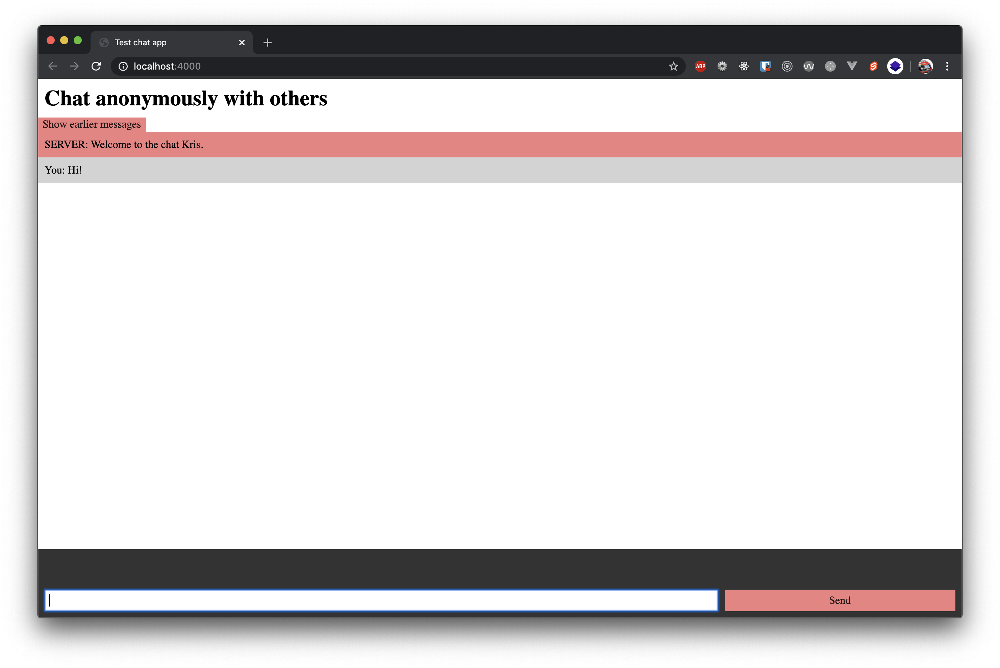

# Real time web 1920
> Build a simple chat application to understand how websockets work



## Prerequisites
Please make sure you have Node installed before trying to run this application locally.

## Installation
```bash
# Clone the repo
git clone https://github.com/kriskuiper/real-time-web-1920.git

# Install dependencies using your favorite package manager
npm install
yarn install

# Run a local development server on port 4000
npm run dev
yarn run dev
```

## Feature list
- [x] Users are able to send eachother chat messages
- [x] Users can choose their own nickname
- [x] Users can see who's typing, it updates to the latest user that's typing
- [x] New users can load the latest 50 messages

## Socket setup
These commands are used by the socket to the client and vice-versa:

### Socket to client(s)
1. `show-messages`
Triggers a function in the client to show the latest messages, using the latest messages (max 50) as payload.

2. `server-message`
Lets the client know that a certain message doesn't come from a user but from the server itself. Sends the message as payload.

3. `chat-message`
Broadcasts a certain users' message to all other users by prefixing it with the username, emits "You: message" to the user who sent it.

4. `typing`
Broadcasts to all users that one certain user is typing. Updates when users start typing.

5. `not-typing`
Broadcasts that a certain user stopped typing.

### Client(s) to socket
1. `set username`
Takes the chosen username as payload to send to the socket, socket sends a `server message` event back to the client welcoming the user and broadcasting to other users that a certain user has joined.

2. `chat message`
Takes a message as payload and sends it to the socket. Socket responds by sending `You: original message` to the client who sent the message and `Username: original message` to the other clients.

3. `typing`
Has no specific payload, just lets the socket know that a user is typing. Gets fired on input of the chat message input.

4. `not typing`
Lets the socket know that a user has stopped typing.

5. `show messages`
Lets the socket know that a user wants to show the latest messages. Socket responds by emitting a `show messages` event to the certain client.

## Wishlist
- [ ] Users should be able to use a `/quote` command that generates and sends a random quote to the chat using the server as messager.
