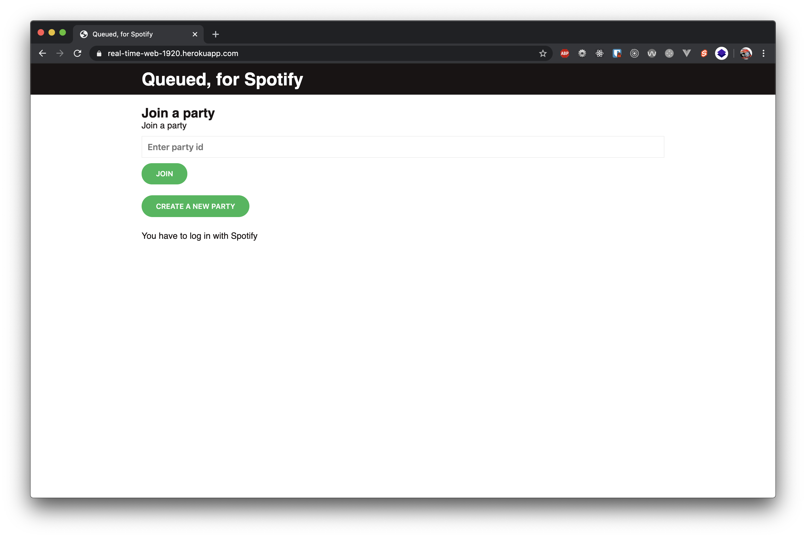
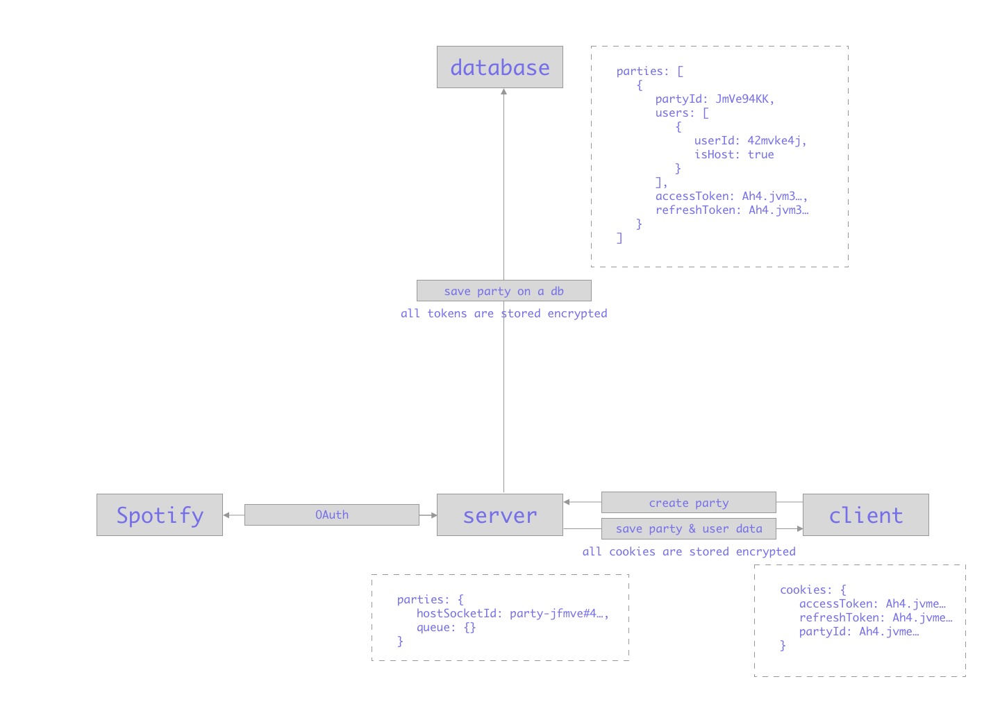
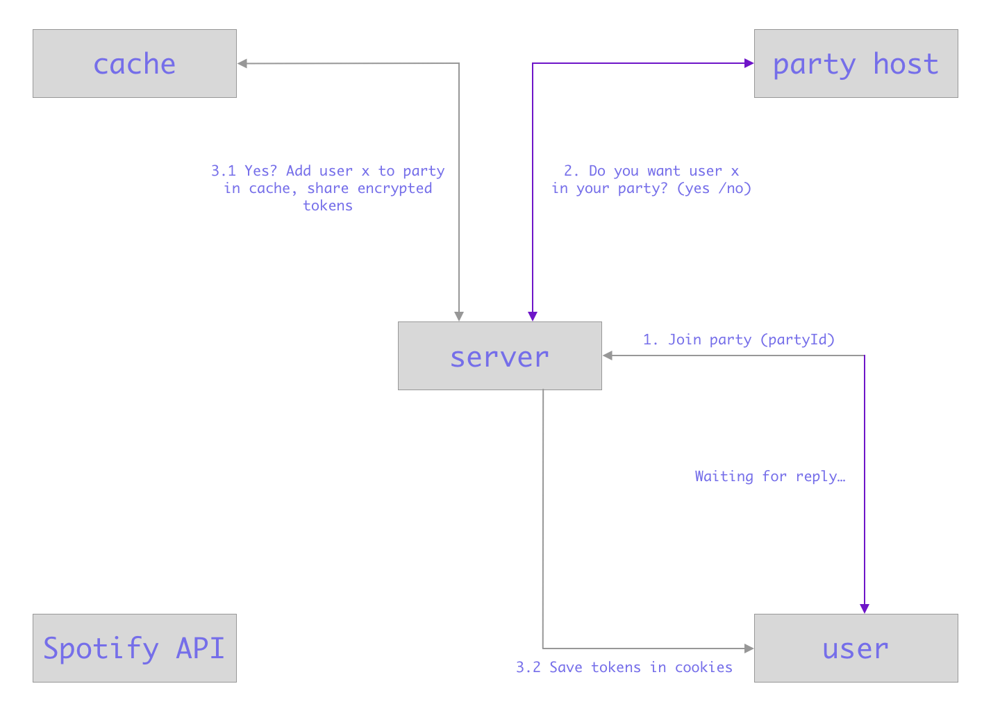
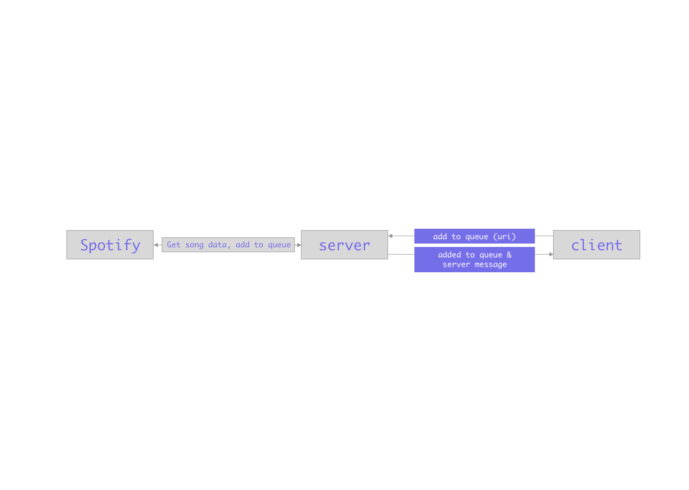

# Queued, for Spotify
> Collaborate on a Spotify queue of songs together using one users' account as the host



## Prerequisites
Make sure you have a Spotify account before working on this project so you can use your own `client id` and `client secret`.

## Getting started
1. Clone this repository
2. Rename `.env.example` to `.env` and fill in the blanks
3. Install the dependencies
4. Run a development server on https://localhost:3000

```bash
git clone git@github.com:kriskuiper/real-time-web-1920.git

yarn install

yarn run dev
```

## About the Spotify API
I use the Spotify API to communicate with the Spotify platform. To work with most of the endpoints of the API you need some form of OAuth flow in your application. You can read all about how I set that up in the [security](#security) section. All communication with Spotify is done through some simple methods that are all in the `server/lib/spotify-auth.js` file and the `server/lib/spotify-fetch.js` file. You can find all endpoints in the `server/lib/constants` file.

### Scopes
When working with the Spotify API, you need to define some scopes that your app needs access to. The user will see what data your app is allowed to access after they click 'confirm'. The scopes I use in this project are:
- `user-read-private`
	- Used to get a users display name.
- `user-modify-playback-state`
	- Used to be able to add songs to the queue.

You can read more about the scopes in the [Spotify API docs](https://developer.spotify.com/documentation/general/guides/scopes/).

### Used endpoints
- `https://accounts.spotify.com/authorize`
	- Used for starting off the OAuth flow; Is used as a redirect link to let users authorize the application to use their data.

- `https://accounts.spotify.com/api/token`
	- Used to get the access- and refresh tokens from Spotify; You get a code after the user has authorized your application which you can then use to get the tokens.

- `https://api.spotify.com/v1/search` :key: needs access token
	- Used to make a user search for songs; You need an access token to use this endpoint.

- `https://api.spotify.com/v1/me/player/queue` :key: needs access token
	- Used to add songs to the queue of the host; Here we need the access token of the host only, more on that later.

- `https://api.spotify.com/v1/me` :key: needs access token
	- Used to get a users display name so the host knows who wants to join the party.

- `https://api.spotify.com/v1/tracks/` :key: needs access token
	- Used to get data about the song that's added to the queue like the title.

## Data life cycle flow
### Hosting a party


### Joining a party


### Add song to queue


## Use of websockets
This project leans heavily on the use of websockets because of it's realtime nature. Here are some commands that get sent around by server and client.

### From server to client
- `is host`: Let the client know that current user is host so he doesn't have to wait before the view switches
- `join` (to host only): Let the host know some user wants to join the party
- `allowed` (to one client at the time): Add user to DB, if that succeeds, let user know they're allowed to join the party
- `disallowed` (to one client at the time): Let client know they're not allowed to join the party, user gets send back to homepage in 4 seconds
- `added to queue` (to namespace): Let clients know a song is added to the queue so the view of the song can change to 'added!'
- `server message` (to namespace): Add "{username} added {song name} to the queue" to the queue view
- `destroy` (to namespace): Destroy the whole session, let all users refer back to the homepage

### From client to server
- `allowed` (from host only): Let the server know a specific socket is allowed to join the party
- `disallowed` (from host only): Let the server know a specific socket is **not** allowed to join the party
- `join`: Let the server check if there are people in the party waiting queue
- `add to queue`: Add a specific song to the queue based on the `data-uri` attribute of the add button

## A note on security :lock:
Mostly since I'm sharing an access token over multiple clients I wanted to have this application as secure as possible.

### Using JWT (JSON Web Tokens)
To store things securely on the database and at all clients I made use of JSON Web Tokens. JWT tokens are tokens that can hold a certain payload. In this case that's mostly an access token or a refresh token. To encrypt or decrypt the token you need some kind of secret, which in this case is stored in an environment variable (`JWT_SECRET`) so it is not known to anybody besides the developer. To state it simple: only the server should be able to read the payload of the tokens and nothing / nobody else.

### Storing data on the database and in cookies
To make the stored data secure I let the server encrypt it to a JSON Web Token before sending anything to the client or the database. The only data that's stored is encrypted into a JWT, therefore only the server can read it's contents.

### Use case: sharing the access- and refresh token of the host between multiple clients securely :hammer:
After we've retrieved the access token from the host we encrypt it to a JWT. Also, the party's id gets encrypted to a JWT. Then we store the encrypted access- and refresh token together with the encrypted party id in cookies. Also, a non-encrypted version of the party-id gets stored in the database under the party's entity.

When a user goes to the homepage and still has cookies that can relate to a party those cookies get deleted. When somebody wants to join the party, the host first has to allow them access to the party. This happens using websockets as described earlier. Somebody that joined only has their own (encrypted) access- and refresh token stored in cookies, as well as the encrypted party id.

Now whenever somebody requests to add a song to the queue, we check if the decrypted party id of the request matches a party on the database. If so, the parties `accessToken` gets decrypted and used in the request to Spotify (see below):

```js
const addToQueue = async (request, uri) => {
	const partyId = decryptJWT(request.cookies[cookies.PARTY_ID]);
	const party = await partyService.getIfExists(partyId);
	const { accessToken } = party;

	const query = queryString.stringify({ uri });
	const options = {
		method: 'POST',
		headers: {
			'Authorization': `Bearer ${decryptJWT(accessToken)}`
		}
	}

	try {
		await fetch(`${spotify.ADD_TO_QUEUE_BASEURL}?${query}`, options);
	} catch(error) {
		throw error;
	}
}
```

Now when the host (from who the access token is shared) leaves the party, a `destroy` event gets fired in the namespace. This does not only mean that all clients get sent back to the homepage (and so their cookies get cleared) but also that the party gets removed from the database so nobody can access the access- and refresh token again, even encrypted.
