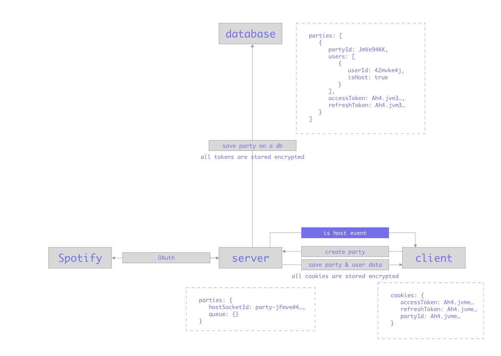
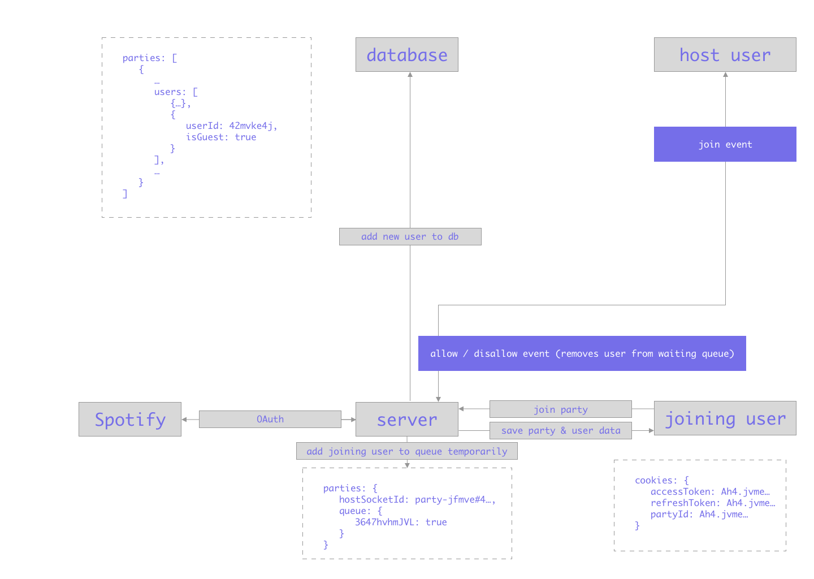

# Queued, for Spotify
> Collaborate on a Spotify queue of songs together using one users' account as the host

## Prerequisites
Make sure you have a Spotify account before working on this project so you can use your own `client id` and `client secret`.

## Getting started
1. Clone this repository
2. Rename `.env.example` to `.env` and fill in the blanks
3. Install the dependencies
4. Run a development server on https://localhost:3000

```bash
git clone git@github.com:kriskuiper/real-time-web-1920.git

yarn install

yarn run dev
```

## About the Spotify API
Some info about the used endpoints, how to get an access key etc.

## Data life cycle flow
### Hosting a party


### Joining a party


### Add song to queue


## Use of websockets
This project leans heavily on the use of websockets because of it's realtime nature. Here are some commands that get sent around by server and client.

### From server to client
<!-- Some info -->

### From client to server
<!-- Some more info -->
